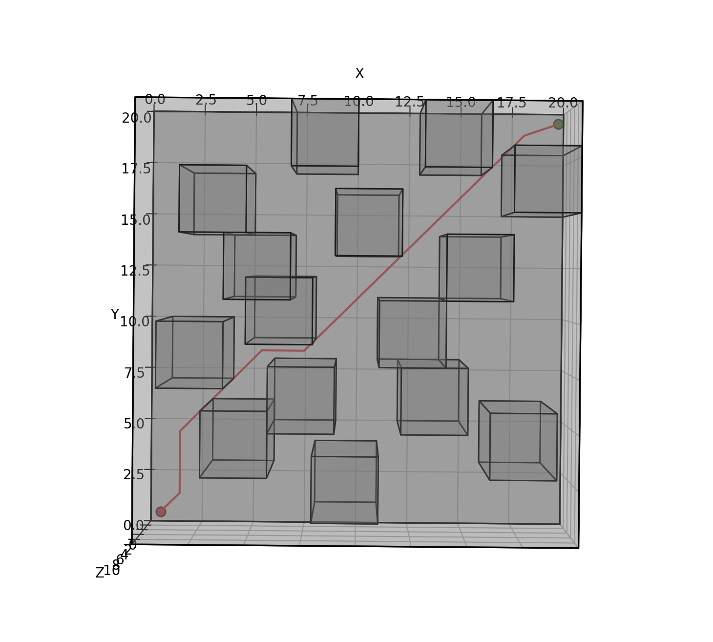
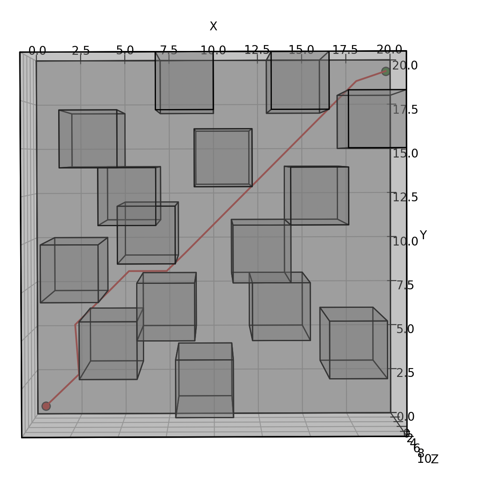
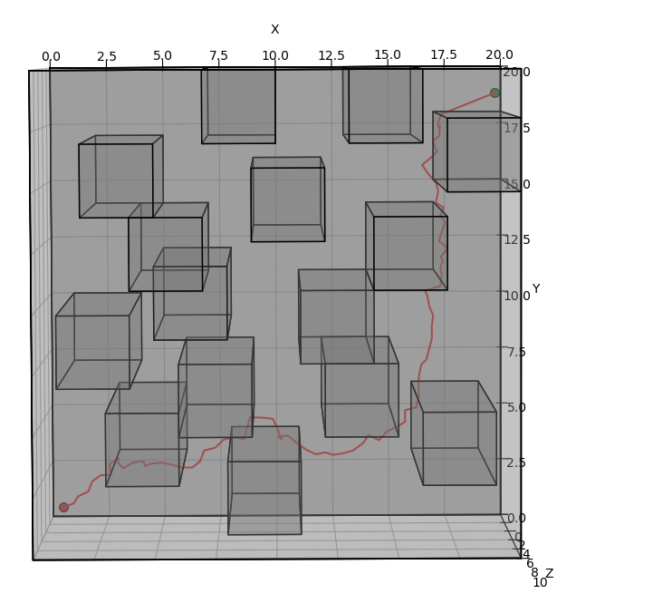
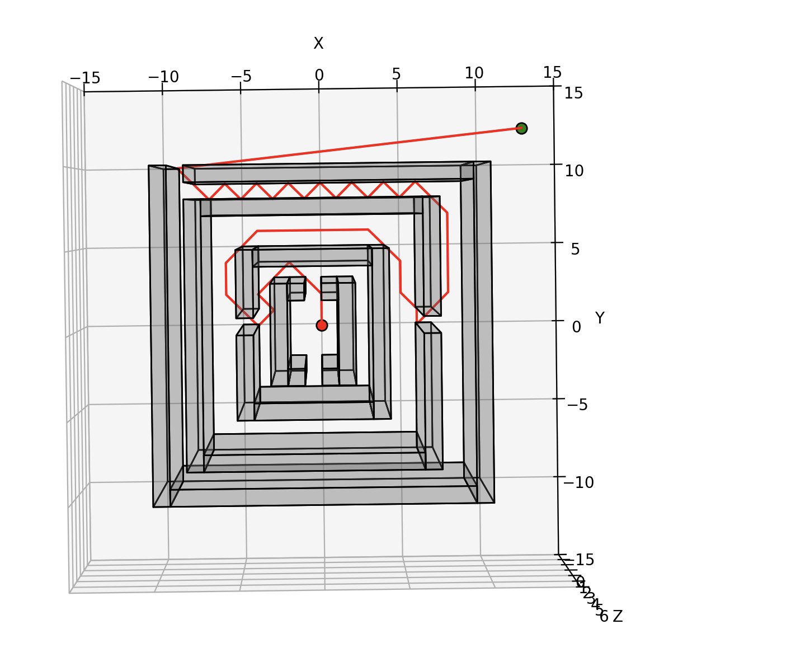
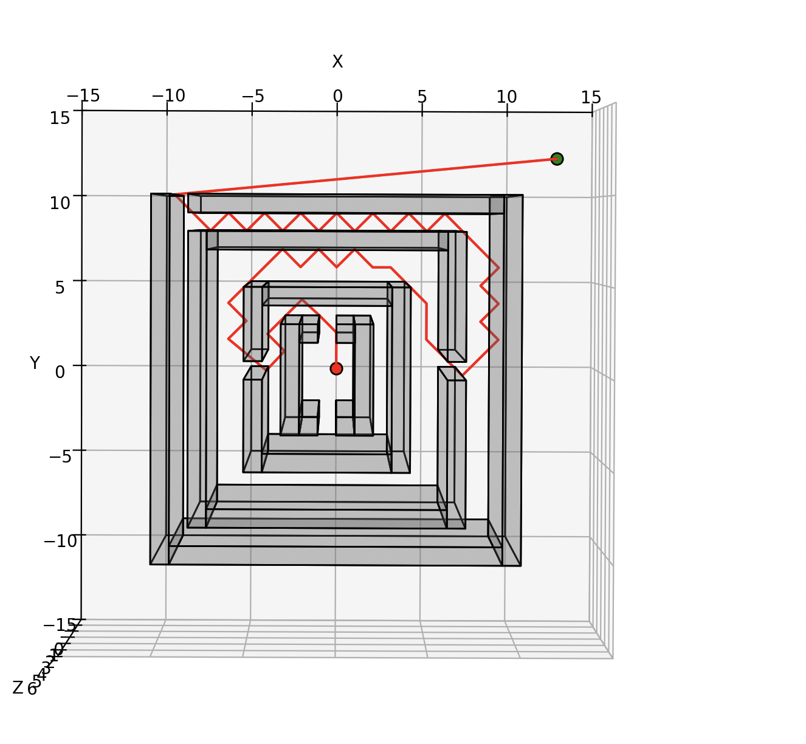
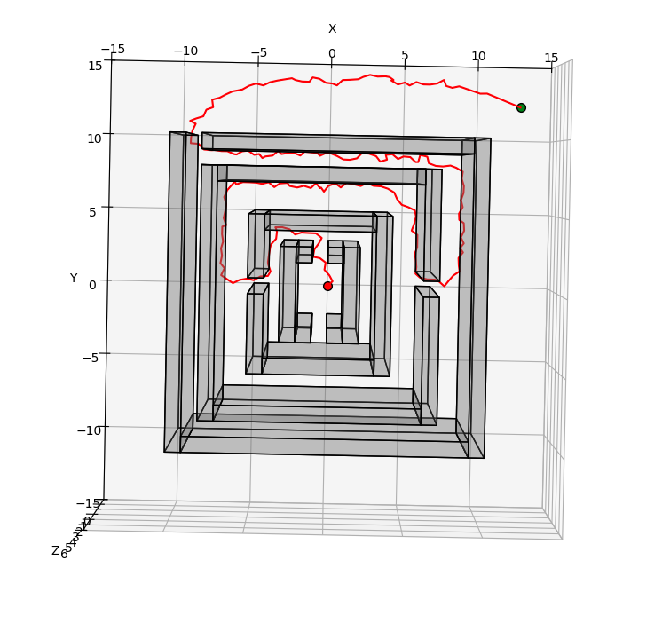

# 3D Motion Planning with Search-based and Sampling-based Algorithms

This project implements and compares two classes of motion planners — **Weighted A**\* and **Rapidly-Exploring Random Trees (RRT)** — for 3D environments with axis-aligned box obstacles. The planners compute **collision-free trajectories** for an autonomous agent navigating continuous 3D space, using a robust collision checker for line-segment vs. AABB intersections.


## Project Structure

```
.
├── collision.py          # Line-segment vs. AABB collision checker
├── environment.py        # 3D map environment setup (boundaries, obstacles, start/goal)
├── astar.py              # Weighted A* planner implementation
├── rrt.py                # RRT planner implementation
├── Planner.py            # Planner class wrapper to switch between algorithms
├── main.py               # Entry point: run planner on selected map
└── README.md             # Project description
```

## Installation

```bash
git clone https://github.com/ivanlin328/3D-Motion-Planning.git
cd 3D-Motion-Planning
pip install -r requirements.txt   # (if provided, otherwise standard Python 3.x packages)
```

## Usage

```bash
python main.py
```

Options (modify in `main.py` or Planner interface):

* Select planner: `'astar'` or `'rrt'`
* Set heuristic inflation factor (ϵ) for Weighted A\*
* Configure RRT parameters: max iterations, step size δ, goal bias probability pgoal
* Choose test environment (7 predefined maps)

## Examples

### Pillars Environment

<table>
  <tr>
    <th>Weighted A* (ϵ=1)</th>
    <th>Weighted A* (ϵ=5)</th>
    <th>RRT</th>
  </tr>
  <tr>
    <td></td>
    <td></td>
    <td></td>
  </tr>
</table>

### Maze Environment

<table>
  <tr>
    <th>Weighted A* (ϵ=1)</th>
    <th>Weighted A* (ϵ=5)</th>
    <th>RRT</th>
  </tr>
  <tr>
    <td></td>
    <td></td>
    <td></td>
  </tr>
</table>

*... more examples for Flappy Bird, Pillars, Window, Tower, Room ...*


## Problem Formulation

* **Space:** 3D Euclidean space bounded by rectangular volume
* **Obstacles:** static, axis-aligned rectangular boxes (AABBs)
* **State:** continuous robot position in R³
* **Goal:** compute minimum-cost collision-free path from start to goal
* **Cost function:** Euclidean arc-length of the path


